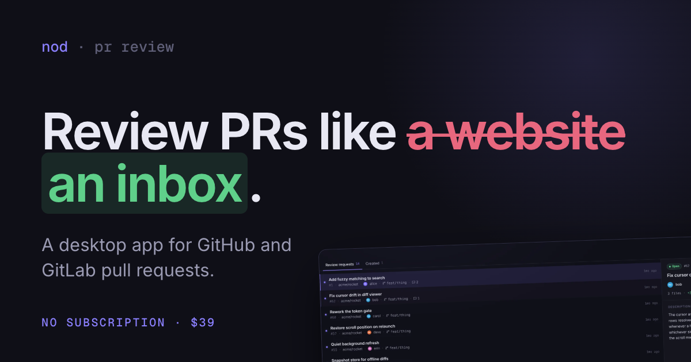
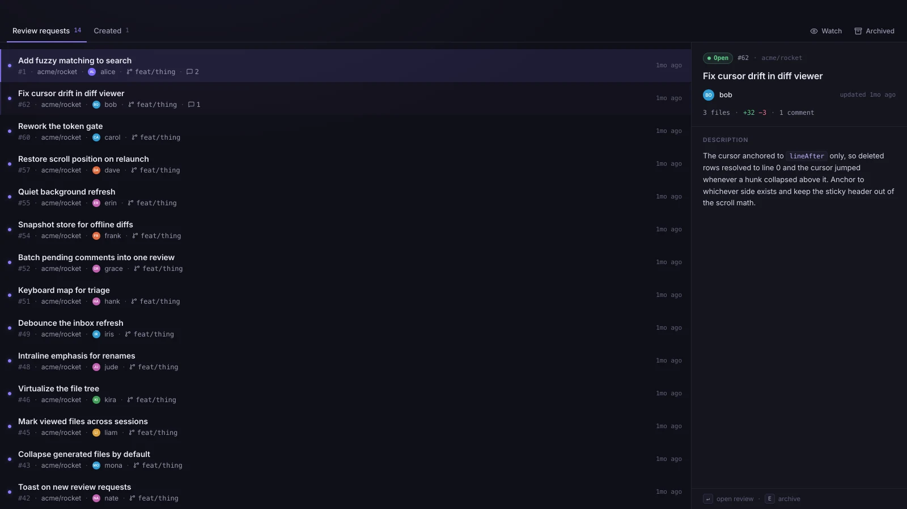

<p align="center">
  
</p>

<p align="center">
  <a href="https://nodreview.com"><b>nodreview.com</b></a> &nbsp;·&nbsp;
  <a href="https://nodreview.com/downloads">Download</a> &nbsp;·&nbsp;
  <a href="#install--auto-updates">Install</a> &nbsp;·&nbsp;
  <a href="#signing-in">Sign in</a> &nbsp;·&nbsp;
  <a href="docs/DEVELOPMENT.md">Build from source</a>
</p>

<p align="center">
  <a href="https://github.com/PauliusKrutkis/pr-flow/releases"></a>
  <a href="LICENSE.md"></a>
</p>

# Nod

Nod is a desktop app for reviewing GitHub and GitLab pull requests. It is
keyboard-first and cache-first: the queue, the diffs and the comments paint
from a local cache, and the whole review runs without the mouse.

It does one thing. Open a review request, read the diff, leave a comment,
move on.

<p align="center">
  
</p>

## What you get

- **The whole loop, no mouse.** Triage with `j` and `k`, open with Enter, step
  the diff, mark files viewed with `e`, submit with `s`. Press `?` in the app
  for the full map.
- **Cache-first.** Anything you have seen paints instantly from disk. The
  network refreshes quietly in the background, every 60 seconds and on window
  focus. No spinners, no refresh button.
- **Resume where you left off.** Launch straight back into the last pull
  request, on the file and scroll position you left it at.
- **Built for reading diffs.** Syntax highlighting, intraline emphasis on
  renames, occurrence marks on double-click, find-in-diff with matches ticked
  on an overview ruler, and full-file context on `shift+v`.
- **Comment without breaking stride.** `c` opens a composer on the cursor line
  or across a selected range. Batch comments into a pending review, or send one
  on its own.
- **New review requests find you.** A fresh request pops a toast you can open
  or dismiss from the keyboard. No webhooks to set up.
- **Not an AI product, not a subscription.** Nod is a tool you own, not a seat
  you rent, and nothing is resold to you on top. Your token stays in the Rust
  backend and never reaches the webview, and out of the box Nod talks to your
  Git host and nowhere else. Ask-about-code exists, but it is opt-in and runs
  on a provider key you bring yourself: your code goes straight to that
  provider, never through me.

## Install & auto-updates

Every release publishes builds for macOS (arm64 and x64), Windows and Linux on
the [Releases page](https://github.com/PauliusKrutkis/pr-flow/releases).
[nodreview.com/downloads](https://nodreview.com/downloads) picks the right one
for your machine.

### macOS

```bash
brew install pauliuskrutkis/tap/nod
xattr -dr com.apple.quarantine /Applications/Nod.app
```

The fully qualified name auto-taps, so `brew tap` is not a separate step. The
second command clears Gatekeeper quarantine, which stands in for notarization
until Apple notarization lands. If you prefer the `.dmg`, download it from
Releases and approve it once under System Settings → Privacy & Security.

### Windows

Download the `.msi` from Releases and run it.

### Linux

Prefer the native package for your distribution. It gives you a launcher entry,
an icon and `prflow://` scheme registration, none of which an AppImage sets up
on its own.

| Distribution | Build |
| --- | --- |
| Debian, Ubuntu, Mint, Pop!_OS | `Nod_<version>_amd64.deb` |
| Fedora, RHEL, openSUSE | `Nod-<version>-1.x86_64.rpm` |
| Anything else | `.AppImage`, portable but slower to start and with no desktop integration |

Hosted apt and dnf repositories and an AUR package are planned. Until they
exist, updating on Linux means installing the newer package from Releases.

### Auto-updates

On macOS and Windows the app keeps itself current: it polls the release feed,
shows an **Update available** prompt, and installs plus relaunches in one click.
Updates are signed with minisign and verified against a public key baked into
the app. On Linux only the AppImage can replace itself, so package installs
update through the package manager instead.

## Signing in

**GitHub.** Click **Sign in with GitHub**. The browser opens GitHub's authorize
page and the app catches the redirect on a local listener, so there is nothing
to copy and paste. Alternatively, paste a personal access token with the `repo`
scope.

**GitLab.** The same two options on gitlab.com, where sign-in uses OAuth with
PKCE. For a self-managed instance, use a personal access token with the `api`
scope plus your host URL, in the GitLab tab of the sign-in screen.

Your token and every cached pull request stay on your machine, under the app
config directory (on macOS,
`~/Library/Application Support/com.pauliuskrutkis.nod/`). The token is held in
the Rust backend so it never reaches the webview. It is stored as plain JSON
today; moving it to the OS keychain is on the list.

## Price and license

Nod is free to evaluate, every feature, no time limit. A license is $39, once,
and carries a year of updates. When the year is up the app keeps working
exactly as it is; you stop receiving new versions. Details on
[nodreview.com](https://nodreview.com/#pricing).

The source is available under the
[Functional Source License 1.1 with an Apache 2.0 future license](LICENSE.md):
read it, build it, change it, use it internally. The one thing you may not do
is ship a competing product. Each release becomes Apache 2.0 two years after it
ships. What is for sale is signed builds and updates, not the code.

## Documentation

| Document | What is in it |
| --- | --- |
| [DEVELOPMENT.md](docs/DEVELOPMENT.md) | Build and run Nod from source |
| [ARCHITECTURE.md](docs/ARCHITECTURE.md) | Layering, state, caching, comment conventions |
| [RUST.md](docs/RUST.md) | Tauri backend module map |
| [TESTING.md](docs/TESTING.md) | Test strategy and what each suite covers |
| [RELEASING.md](docs/RELEASING.md) | Cutting a release, signing, commercial launch |
| [DESIGN.md](docs/DESIGN.md) | Product and interaction decisions |
| [BACKLOG.md](docs/BACKLOG.md) | What is planned, and the reasoning behind it |

Built with Tauri 2, Rust, React 19, TypeScript and Tailwind v4.
